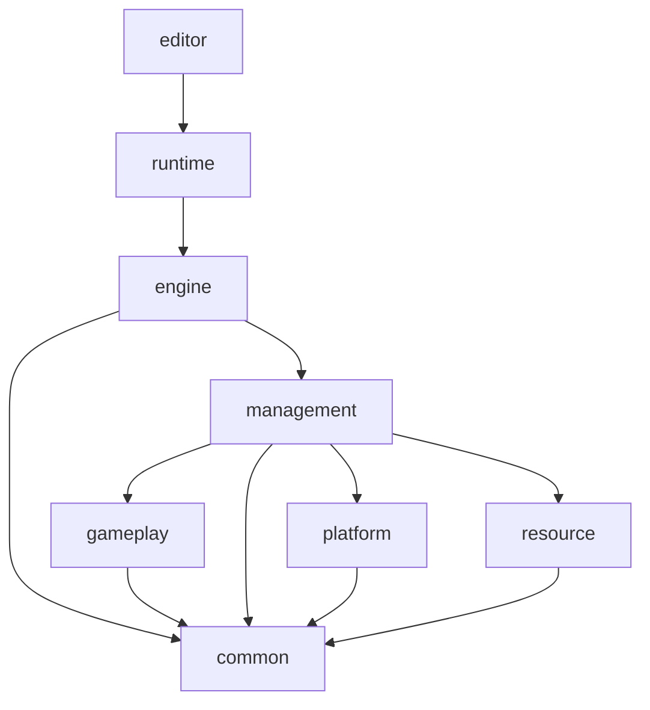

# TaixuEngine

A simple 3D game engine.

TODO: This will be a screenshot.

## How to build

```shell
mkdir build
cd build
cmake ..
make
```

## Features

## Architecture


```mermaid
flowchart TD
    editor --> runtime;
    runtime --> engine;
    engine --> common;
    engine --> management;
    management --> gameplay;
    management --> resource;
    management --> platform;
    gameplay --> common;
    management --> common;
    platform --> common;
    resource --> common;
```