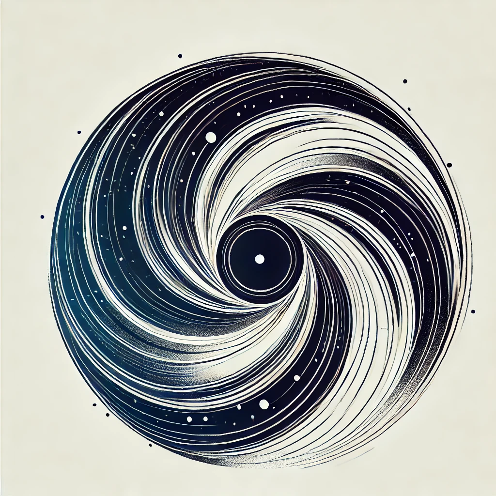
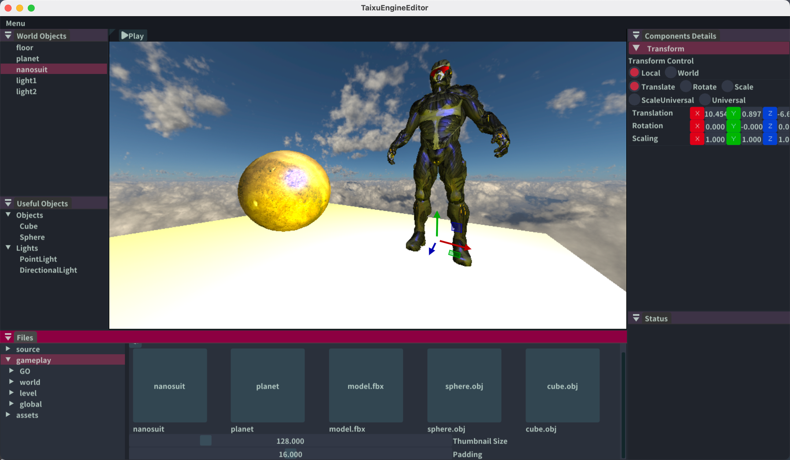
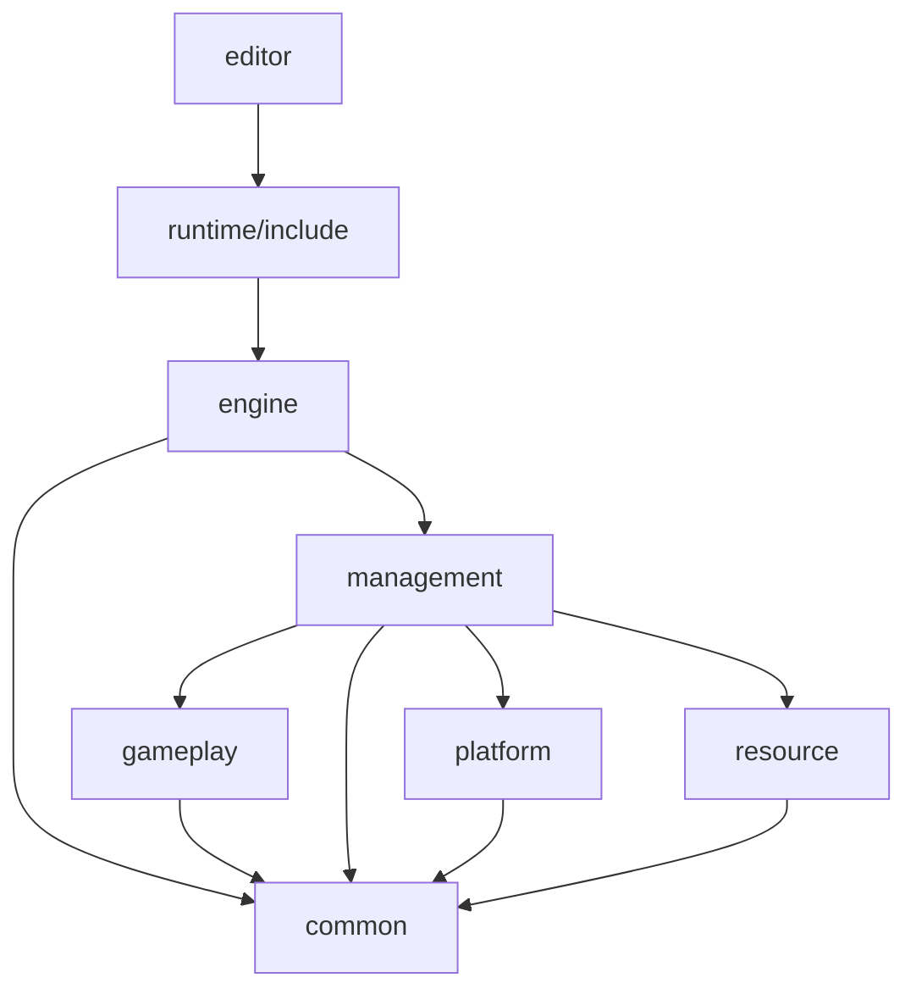

<p align="center">
  <a href="taixuengine.fivezha.cn"></a>
</p>

<div align="center">

# TaixuEngine

_✨ A simple 3D game engine. ✨_

</div>



Note: This is in OpenGL version in [main branch](https://github.com/xmmmmmovo/TaixuEngine/tree/main)

## Roadmap

- [ ] Vulkan Support
- [ ] Resource Manager
- [ ] Scene
- [ ] TaskQueue
- [ ] Audio
- [ ] Animation
- [ ] Script

## How to build

**Prerequisites:**

- C++20 compliant compiler
- [python](https://www.python.org/)
- [cmake](https://cmake.org/)
- [Vulkan SDK](https://vulkan.lunarg.com/sdk/home)

**Build:**

```shell
mkdir build
cd build
cmake ..
make
```

## Features

### Supporting API

|  API  |                Progress                |
| :----: | :------------------------------------: |
| OpenGL | Deprecated(old version in main branch) |
| Vulkan |                  WIP                  |

Note: New RHI design, others api will be implemented by `Mesa` project.

## Architecture



## Third Parties

[Copyrights](./3rdparty/README.md)

## Designs

- No Exception Design
- Constructor Exception Safe
