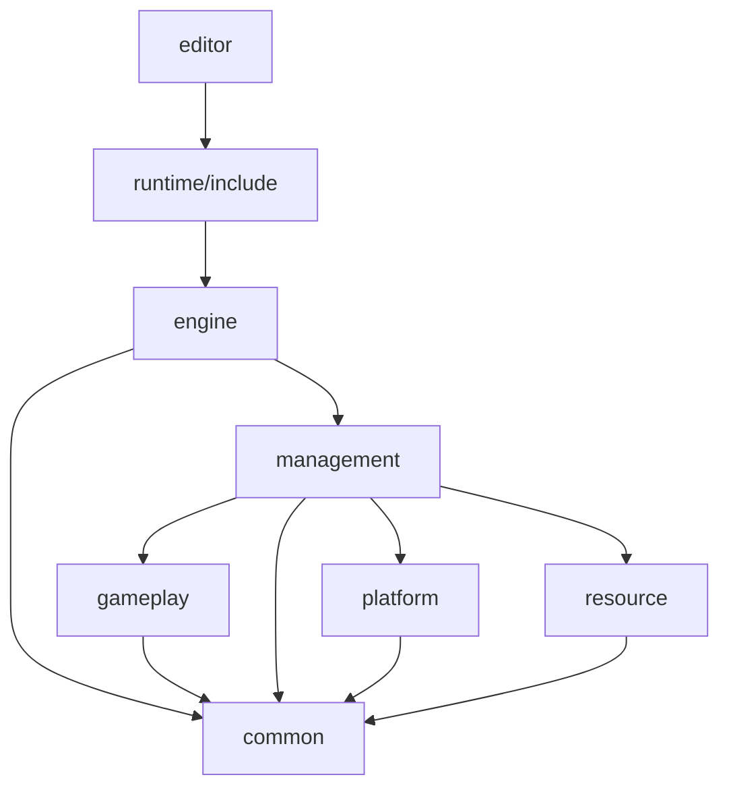

# TaixuEngine

A simple 3D game engine.


Note: This is in OpenGL version in [main branch](https://github.com/xmmmmmovo/TaixuEngine/tree/main)

## How to build

```shell
mkdir build
cd build
cmake ..
make
```

## Features

### Supporting API

|  API   |                Progress                |
| :----: | :------------------------------------: |
| OpenGL | Deprecated(old version in main branch) |
|  DX11  |                  WIP                   |
| Vulkan |                  WIP                   |


## Architecture

